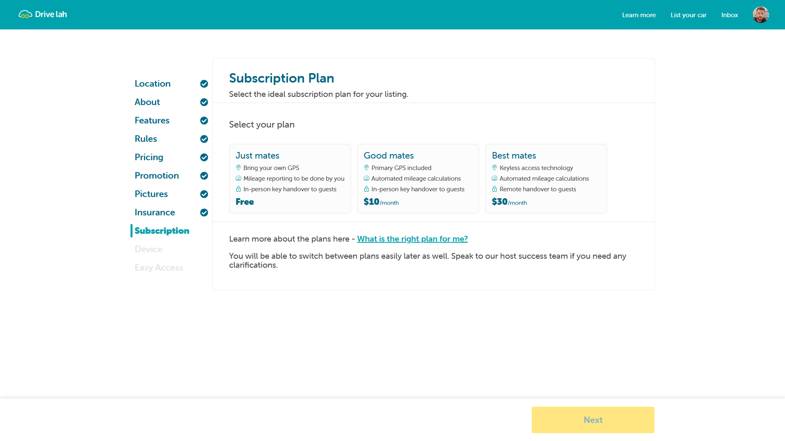
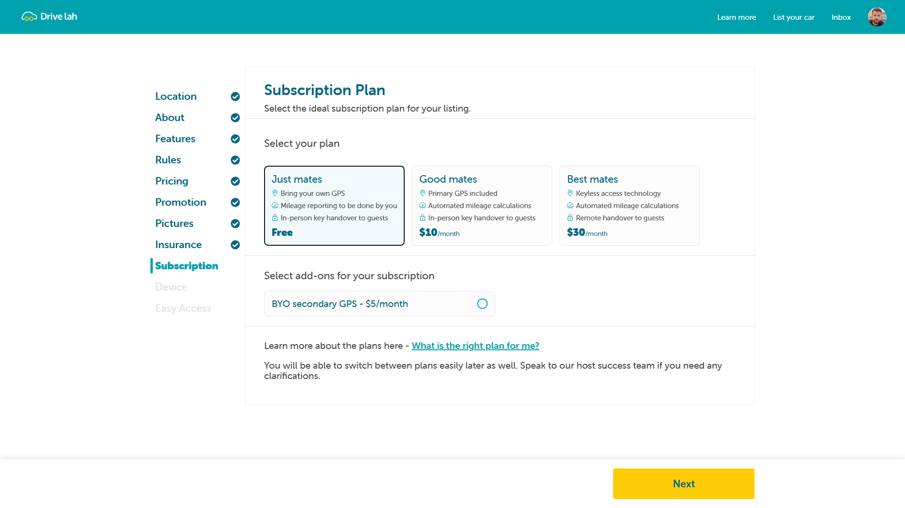
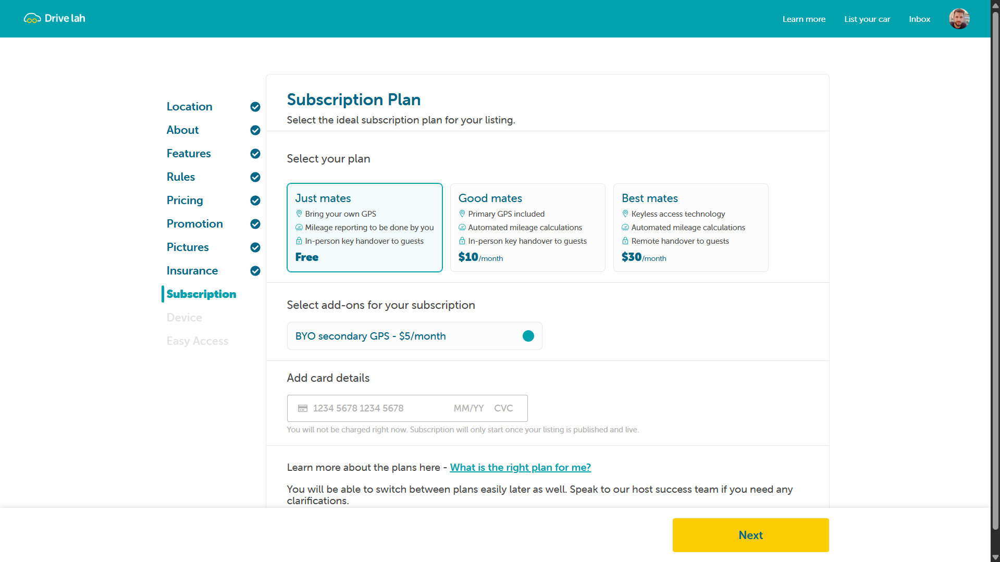
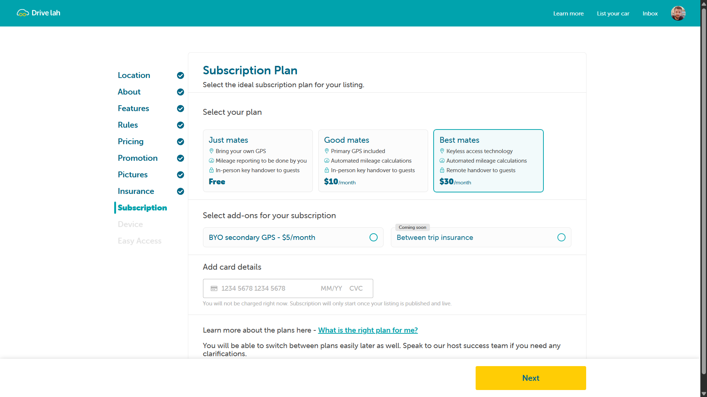
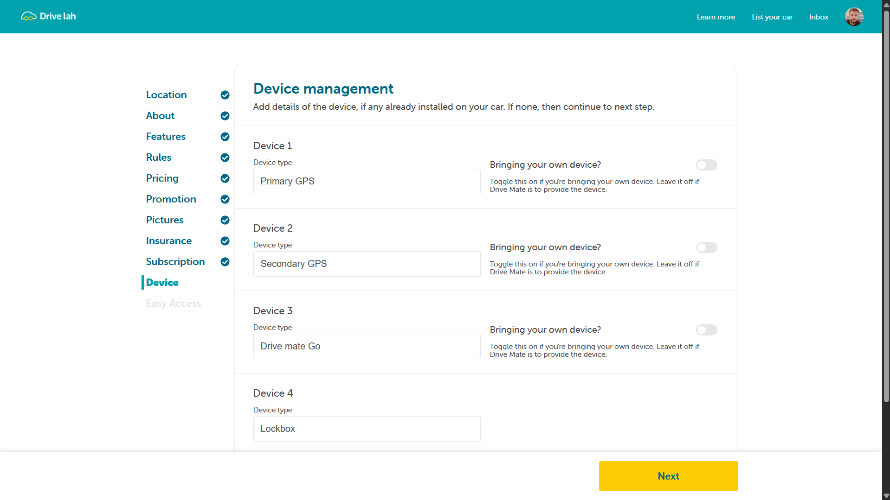
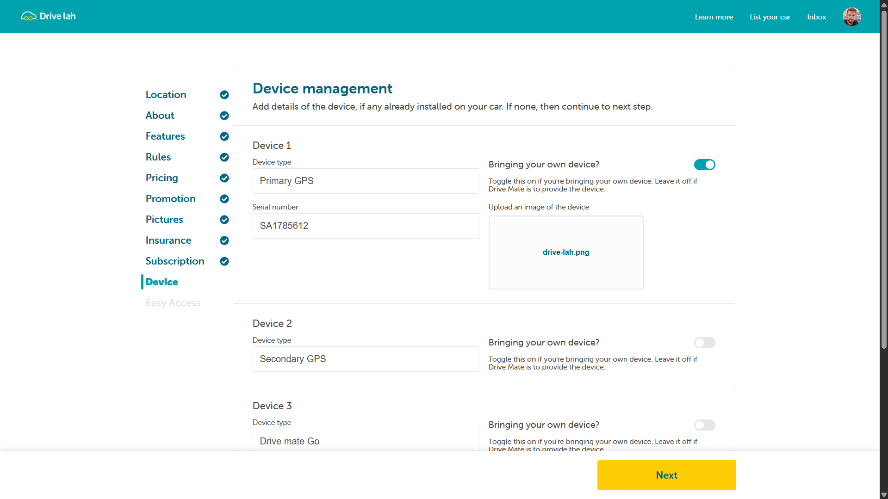
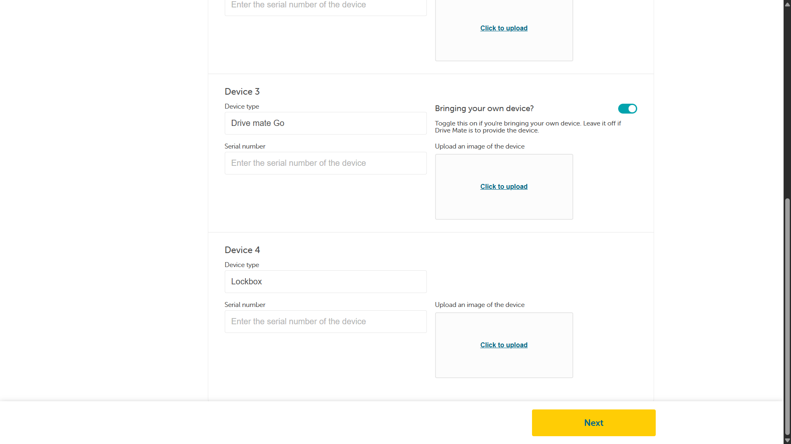
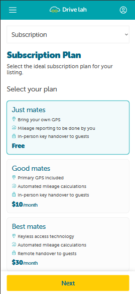
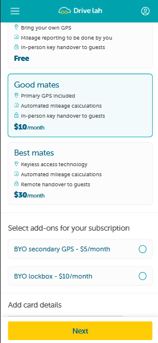
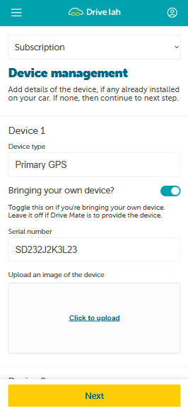

<center style>

<div style="background:#111; padding:20px; display:inline-block; border-radius:12px;">
  
</div>

</center>

## Drive lah test

This task is a Prototype on two of the pages of Drive lah built purely based on the designs provided.

> Live URL: https://drive-lah-nine.vercel.app/listing/subscription

## Tech Stack

- React
- React Router Dom
- SCSS
- Vite (Bundler)
- Zustand (State Management)
- react-icons (external lib) [Had to use as there were few icons missing in the designs.]
- Custom Hooks

> Why Zustand?
> Ans: As the requirement was to make use of localStorage. So, it was a better, fast and minimal option to use Zustand rather than manually setting up + cleaning up with react context.
> I used Zustand's persist middleware to store data to localStorage with no / less clean up or syncing of variables from localStorage to app.

## Things to Note:

- Only the two pages are developed based on the designs.
- So, Make sure to visit **/listing/Subscription** and **/listing/Device** only.
- As going out of the flow might look weird as they were not developed.
- I've built the folder structure imagining scalability of the app.
- Navigation Menu for the mobile view is just a placeholder and non-functional.
- There are no data validations for card details.
- Page will retain data even if refreshed.

### Project Screenshots

| Subscription Page (Desktop View)                 |
| ------------------------------------------------ |
|  |

| Plan Selection                                    |
| ------------------------------------------------- |
|  |

| Plan Selection (Single - Add-on)                    | Plan Selection (Multi - Add-on)                         |
| --------------------------------------------------- | ------------------------------------------------------- |
|  |  |

| Device Management (Desktop View)                 |
| ------------------------------------------------ |
|  |

| BYOD - Data Filled State                             | BYOD - Other Devices                             |
| ---------------------------------------------------- | ------------------------------------------------ |
|  |  |

| Subscription (Mobile View)                         | Subscription (Plan Selection)                        | Device Management (Mobile View)                          |
| -------------------------------------------------- | ---------------------------------------------------- | -------------------------------------------------------- |
|  |  |  |

## Wanna Run in your Machine?

Clone the project

```bash
  git clone https://github.com/ShahbaazX786/drive-lah-replica.git
```

Go to the project directory

```bash
  cd drive-lah-replica
```

Install dependencies

```bash
  npm install
```

Start the server

```bash
  npm run s or npm run start
```

## Environment Variables

This is a very simple UI prototype focused on UI, typography, web storage and a little bit of functionality. so no env variables needed.

## Feedback

##### If you have any feedback, please reach out to me in below ways:

- LinkedIn - https://www.linkedin.com/in/shaik-shahbaaz-alam/
- Github - Just Dm me or raise a PR.
- Twitter / X - https://twitter.com/shahbaazx24
- Email - shahbaazalam78@gmail.com

## Support

For support, you can star 🌟 this repo or follow me on my social handles.s
